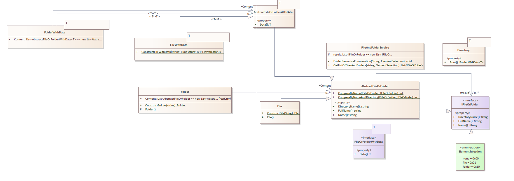

= SDE Tools Notes
Doc Writer <christian.popescu@outlook.com>
v 1.0, 2021-12-02
:sectnums:
:toc:
:toclevels: 5
:pdf-page-size: A3

== Analysis :

For the moment there are 3 interesting projects:

* AbstractDataHelper -> Working with collections + serializations to and from files

* File helper -> Line changer

* FileAndFolderHelper -> There is two complicated. Could be interesting to create an in memory File and Folder structure (to avoid to reload every time from HDD).

== Next Step

Cleanup libraries + create small useful classes

== Recovered from one note document
Files and folders diagram

Purpose Create